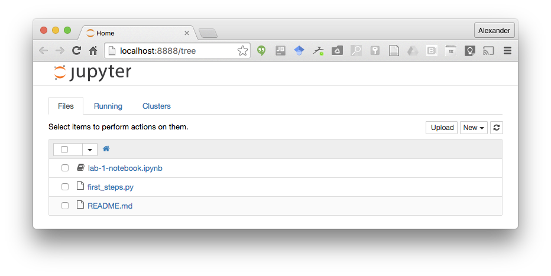

# Homework 0
**Introduction to Data Science - MATH 4100 / COMP 5360.**  
*This homework is due before class on Thursday, January 11th.*  


Welcome to MATH 4100 and Computing 5360 - Introduction to Data Science. In this class, we will be using a variety of tools that will require some initial configuration. To ensure everything goes smoothly moving forward, we will set up the majority of those tools in this homework. This homework will not be graded, but **it is essential that you complete it before the second lecture** as it sets up the tools that we will be using in class for exercises.

## 1. Survey

This is a class about data, so we also want to have some data about you! Please complete the course survey [located here](https://goo.gl/forms/Ffm0cP4rgECnw9Hp2). It should only take a few moments of your time.

## 2. Introduction

Once you are signed up for the class and have access to [Slack](https://datasciencecourse2018.slack.com/), introduce yourself to your classmates and course staff by introducing yourself in the #general channel. Include your name/nickname, your affiliation, why you are taking this course, and tell us something interesting about yourself (e.g., an unusual hobby, past travels, or a cool project you did, etc.). Also tell us whether you have experience with data science.

## 3. Setup

In the labs we'll work on practical skills related to what we discuss in the lectures. That means we'll write code, and we'll do that in a programming language called Python.

Python has three advantages for this class: it's pretty easy to learn, it's the language of choice for many data scientists, and it can be used inside of Jupyter Notebooks - more on the latter will follow later.

We also assume that you know the basics of how to work with a terminal / console. If you don't check out an introduction like [this](http://tutorial.djangogirls.org/en/intro_to_command_line/).  

First, we'll need to install some things:

### 3.1 Installing Python

Chances are, if you're on a mac, you already have Python installed. You can simply try to run python from a console by running

```
$ python
```

However, as most software, Python comes in different versions (default on Mac is Python 2) and is packaged differently depending on your needs. In this class we'll use a Python distribution called Anaconda. Anaconda comes with a lot of packages that we'll need pre-installed, so it should be the most hassle-free option for us.

Go to [this website](https://www.anaconda.com/download/) and install anaconda for Python 3.6 for your operating system. [Here](https://docs.continuum.io/anaconda/install) are installation instructions if you need them.

Once you've installed Anaconda, close your terminal window and re-open it - otherwise your terminal won't recognize the Anaconda commands.

Anaconda is both, a package manager and an environment manager. A package manager manages, well, packages. Packages add specific pieces of functionality - there are packages for web scraping, or for data visualization, for example. An environment manager, in contrast, allows you to have different versions of packages installed at the same time. We'll dive into environments and packages when we need them at a later point.

Let's see whether Anaconda works as intended. Run:

```
$ conda --version
```

from your terminal. You should see something like this as a result:

```
$ conda --version
conda 4.3.30
```

Similarly, for python, you should see something like this:

```
$python --version
Python 3.6.3 :: Anaconda, Inc.
```

You can also check out the [official website](http://conda.pydata.org/docs/test-drive.html) for more details on anaconda, environments, and packages.

### 3.2 Installing Jupyter Notebooks

***Check out the official Jupyter Notebooks documentation [here](http://jupyter.readthedocs.io/en/latest/index.html) for all the details***

Another alternative of running Python is through Jupyter Notebooks. In this class we'll mainly use notebooks as they are great for the data science process and for teaching, but you should be aware of the other options we discuss here.

Notebooks are stored in files that end with a `.ipynb` extension. Download [the notebook file for the second lecture](https://github.com/datascience-course/2018-datascience-lectures/tree/master/02-basic-python/) and save it to a folder.

Notebooks make use of an improved, interactive client for python called [IPython](https://ipython.org/). IPython might already be installed on your machine, but probably not in the right version. We'll use anaconda to install the proper version of IPython. Run:

```
$ conda install ipython
```

and confirm that in fact ipython 4.2.* is installed.
```
$ ipython --version
6.2.1
```

Now, change directories in your console so that you're in the directory where the notebook file is saved and run:

```
$ jupyter notebook
```

This will start the notebook server and should open up a browser window point to [http://localhost:8888/](http://localhost:8888/) that will look like that:



Click on the `lecture-02-notebook.ipynb` entry to see if it works. We'll take it from there in the labs!

### 4. Self Study: Python

We recommend that you go through the excellent [Code Academy Python Tutorials](https://www.codecademy.com/learn/learn-python). For this Homework, go through Unit 1: "Python Syntax", and Unit 2: "Strings and Console Output".
